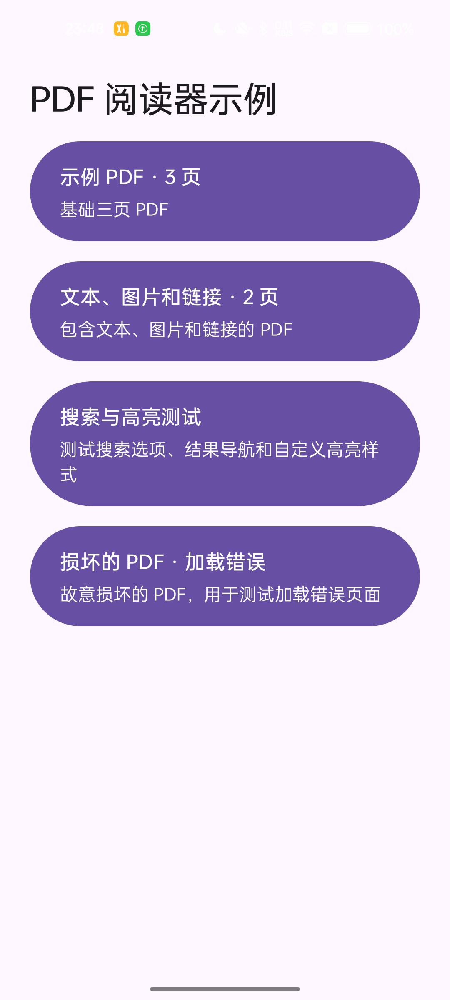
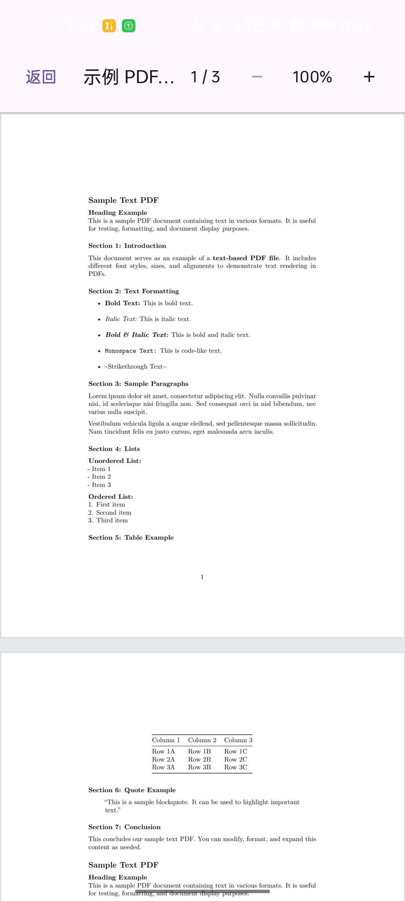

# PDF Viewer KMP

[](https://central.sonatype.com/artifact/io.github.limuyang2/pdf-core)
[](https://central.sonatype.com/artifact/io.github.limuyang2/pdf-viewer)
[](https://context7.com/limuyang2/pdf-viewer-kmp)

[English](README.md)

## 文档

| 库 | English | 简体中文 |
| --- | --- | --- |
| `pdf-core` | [Using PDF Core](docs/using-pdf-core.md) | [PDF Core 使用指南](docs/using-pdf-core.zh-CN.md) |
| `pdf-viewer` | [Using PDF Viewer](docs/using-pdf-viewer.md) | [PDF Viewer 使用指南](docs/using-pdf-viewer.zh-CN.md) |
| API 参考 | [Dokka](https://limuyang2.github.io/pdf-viewer-kmp/) | — |

PDF Viewer KMP 是基于 PDFium 的 Kotlin Multiplatform PDF 库，可用于
读取、渲染和显示 PDF 文档。

## Demo

下载已签名的 Android 示例应用：[pdf-viewer-kmp-demo.apk](demo/pdf-viewer-kmp-demo.apk)。

以下截图来自在 OPPO Android 真机上运行的 Demo：

| Demo 首页 | PDF 阅读器 | 搜索与高亮 |
| --- | --- | --- |
|  |  |  |

项目包含两个公开库：

| 库 | 用途 |
| --- | --- |
| `pdf-core` | 打开 PDF 文档，提供元数据、页面渲染、文本、搜索和链接等不依赖 Compose UI 的 API。 |
| `pdf-viewer` | 提供 Compose Multiplatform `PdfView` 组件，并传递依赖 `pdf-core`。 |

## 支持平台

| 平台 | 支持目标 |
| --- | --- |
| Android | arm32、arm64、x86、x64 |
| iOS | 真机 arm64、模拟器 arm64 |
| JVM 桌面端 | macOS arm64/x64、Linux x64、Windows x64 |
| 浏览器 | JavaScript、Wasm |

目前不支持 iOS x64 和 Catalyst。内置 PDFium 固定为 `chromium/7961`
版本，不包含 V8 和 XFA。

## 添加依赖

添加 Maven Central，并在 `commonMain` 中选择需要的库：

```kotlin
repositories {
    mavenCentral()
}

kotlin {
    sourceSets {
        commonMain.dependencies {
            // 只使用 PDF 底层 API：
            implementation("io.github.limuyang2:pdf-core:0.3.0")

            // 或使用 Compose Viewer，pdf-core 会被传递引入：
            implementation("io.github.limuyang2:pdf-viewer:0.3.0")
        }
    }
}
```

## 快速开始：PDF Core

应用只需要读取或渲染 PDF、不需要内置 Compose UI 时，可直接使用
`pdf-core`：

```kotlin
import io.github.limuyang2.pdf.core.PdfPixelSize
import io.github.limuyang2.pdf.core.PdfRenderRequest
import io.github.limuyang2.pdf.core.PdfSource
import io.github.limuyang2.pdf.core.PdfViewer

suspend fun renderFirstPage(pdfBytes: ByteArray): ByteArray {
    val document = PdfViewer.open(PdfSource.Bytes(pdfBytes))
    try {
        require(document.pageCount > 0)

        val bitmap =
            document[0].render(
                PdfRenderRequest(
                    outputSize = PdfPixelSize(1200, 1600),
                ),
            )
        try {
            return bitmap.copyPixels()
        } finally {
            bitmap.close()
        }
    } finally {
        document.closeAndAwait()
    }
}
```

密码、元数据、文本、搜索、链接、位图格式、资源生命周期、异常和各平台配置，
请参阅 [PDF Core 使用指南](docs/using-pdf-core.zh-CN.md)。

## 快速开始：PDF Viewer

`pdf-viewer` 使用纵向滚动的 Compose 页面列表显示整个文档：

```kotlin
import androidx.compose.foundation.layout.fillMaxSize
import androidx.compose.runtime.Composable
import androidx.compose.ui.Modifier
import io.github.limuyang2.pdf.core.PdfDocument
import io.github.limuyang2.pdf.viewer.PdfView
import io.github.limuyang2.pdf.viewer.rememberPdfViewState

@Composable
fun DocumentPreview(document: PdfDocument) {
    val state = rememberPdfViewState()

    PdfView(
        document = document,
        state = state,
        modifier = Modifier.fillMaxSize(),
        maxZoom = 4f,
        gestureZoomEnabled = true,
    )
}
```

调用方拥有 `PdfDocument`，必须在页面销毁时关闭它。`PdfView` 只负责关闭内部
临时渲染的位图。

在 Compose 中打开文档、状态控制、缩放配置、渲染尺寸限制、自定义加载和错误
UI、链接处理等内容，请参阅
[PDF Viewer 使用指南](docs/using-pdf-viewer.zh-CN.md)。

## 各平台配置概览

- **Android：** 支持 API 24 及更高版本，PDFium JNI runtime 会自动加载。
- **JVM：** 原生 PDFium 库已内置，会自动解压到系统临时目录。部分 JVM
  运行时可能需要 `--enable-native-access=ALL-UNNAMED`。
- **浏览器：** 需要在配置的 PDFium 静态资源目录中部署
  `manifest.properties`、`pdfium-adapter.js`、`pdfium.js` 和
  `pdfium.wasm`。
- **iOS：** 最低部署版本为 iOS 14.0。PDFium 已通过发布的 KLIB 静态链接，
  应用无需额外嵌入动态库。

详细配置参见
[PDF Core 使用指南](docs/using-pdf-core.zh-CN.md#各平台配置)。

## 当前能力

所有当前后端均支持：

- 字节数组输入源和密码保护文档；
- 文档信息、权限、元数据和页面标签；
- 页面尺寸、固有旋转方向和边界框；
- 完整页面 BGRA8888 渲染；
- 基础文本提取；
- 支持大小写、整词和连续匹配选项的文本搜索；
- 内部跳转目标、URI 动作和链接标注区域。

调用可选 API 前，可以通过 `PdfViewer.capabilities` 检查当前平台能力。

当前尚未实现：书签、内嵌缩略图、公开后端的文本布局几何信息、随机访问输入源、
局部裁剪渲染、表单、编辑、渐进式加载或渲染、JavaScript 和 XFA。不支持的操作
会抛出 `PdfUnsupportedFeatureException`。

## 许可证

[MIT](LICENSE)
